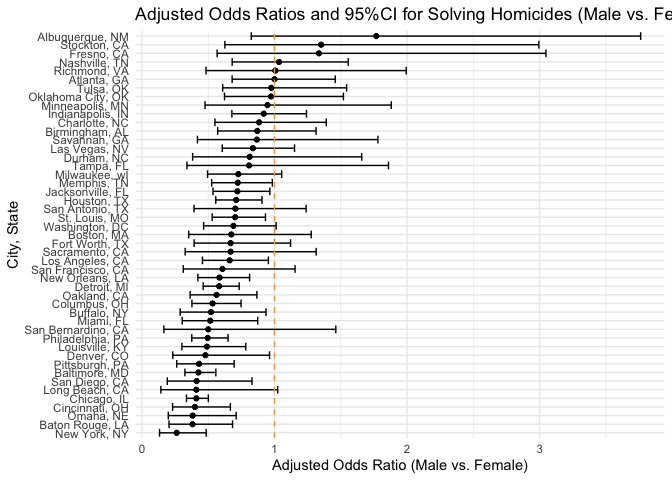
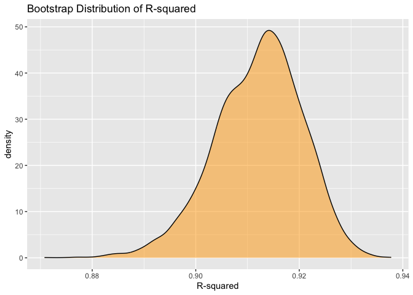
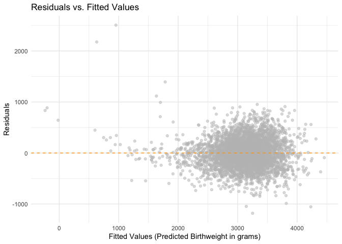
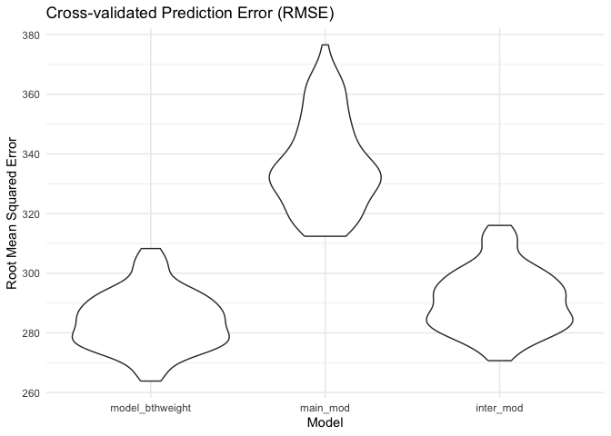

p8105_hw6_lg3450
================

first we load all necessary libraries:

``` r
library(tidyverse)
library(modelr)
library(broom)
library(patchwork)
```

# Problem1

**The Washington Post has gathered data on homicides in 50 large U.S.
cities and made the data available through a GitHub repository here. You
can read their accompanying article here.**

- **Q1.1: Create a city_state variable (e.g. “Baltimore, MD”), and a
  binary variable indicating whether the homicide is solved. Omit cities
  Dallas, TX; Phoenix, AZ; and Kansas City, MO – these don’t report
  victim race. Also omit Tulsa, AL – this is a data entry mistake. For
  this problem, limit your analysis those for whom victim_race is white
  or black. Be sure that victim_age is numeric.**

We first clean the dataset based on the requirements.

``` r
homicide_df = 
  read_csv("../homicide-data.csv") |>   
  mutate(
    # create city_state variable
    city_state = str_c(city, ", ", state),
    # add binary indicator
    resolved = as.numeric(disposition == "Closed by arrest"),
    # make victim_age numeric
    victim_age = as.numeric(victim_age)) |> 
  # omit 4 cities & limit analysis to White and Black
  filter(
    !city_state %in% c("Dallas, TX", "Phoenix, AZ", "Kansas City, MO", "Tulsa, AL"),
    victim_race %in% c("White", "Black"))
```

- **Q1.2: For the city of Baltimore, MD, use the glm function to fit a
  logistic regression with resolved vs unresolved as the outcome and
  victim age, sex and race as predictors. Save the output of glm as an R
  object; apply the broom::tidy to this object; and obtain the estimate
  and confidence interval of the adjusted odds ratio for solving
  homicides comparing male victims to female victims keeping all other
  variables fixed.**

``` r
# fit the logistic regression model for Baltimore, MD
baltimore_glm = 
  homicide_df |> 
  filter(city_state == "Baltimore, MD") |> 
  glm(resolved ~ victim_age + victim_sex + victim_race, family = binomial(), data = _)

baltimore_glm |> 
  broom::tidy(conf.int = TRUE) |> 
  mutate(
    OR = exp(estimate), 
    OR_CI_lower = exp(conf.low),
    OR_CI_upper = exp(conf.high)) |> 
  filter(term == "victim_sexMale") |> 
  select(OR, OR_CI_lower, OR_CI_upper) |> 
  knitr::kable(
    digits = 3,
    col.names = c("estimated OR", "95% CI Lower", "95% CI Upper"),
    caption = "Table1: Estimate of Adjusted Odds Ratio for Male vs. Female Victims in Baltimore, MD", 
    align = "c")
```

| estimated OR | 95% CI Lower | 95% CI Upper |
|:------------:|:------------:|:------------:|
|    0.426     |    0.324     |    0.558     |

Table1: Estimate of Adjusted Odds Ratio for Male vs. Female Victims in
Baltimore, MD

The adjusted odds ratio for solving homicides comparing male victims to
female victims in Baltimore is 0.426 (95% CI: 0.324, 0.558). This
indicates that, holding victim age and race constant, homicides with
male victims are significantly less likely to be resolved than those
with female victims. Specifically, the odds of resolution for a male
victim are approximately 43% of the odds for a female victim.

- **Q1.3: Now run glm for each of the cities in your dataset, and
  extract the adjusted odds ratio (and CI) for solving homicides
  comparing male victims to female victims. Do this within a “tidy”
  pipeline, making use of purrr::map, list columns, and unnest as
  necessary to create a dataframe with estimated ORs and CIs for each
  city.**

``` r
# run glm for each city using map
city_glm_results = 
  homicide_df |> 
  nest(data = -city_state) |> 
  mutate(
    # fit the logistic regression model for each city
    models = map(data, \(df) glm(resolved ~ victim_age + victim_sex + victim_race, 
                             family = binomial(), data = df)),
    
    # tidy the output of each model and get CIs
    tidy_results = map(models, \(mod) broom::tidy(mod, conf.int = TRUE))) |> 
  select(-models, -data) |> 
  unnest(cols = tidy_results) |> 
  mutate(
    # convert log-odds to Odds Ratios
    OR = exp(estimate), 
    OR_CI_upper = exp(conf.high),
    OR_CI_lower = exp(conf.low)) |> 
  # filter for the term of interest (Male vs Female)
  filter(term == "victim_sexMale") |> 
  select(city_state, OR, OR_CI_lower, OR_CI_upper) |> 
  # sort by Odds Ratio (lowest to highest)
  arrange(OR)

# display the table
city_glm_results |> 
  slice(1:10) |>
  knitr::kable(
    digits = 3,
    col.names = c("City", "estimated OR", "95% CI Lower", "95% CI Upper"),
    caption = "Table 2: Odds Ratios for Solving Homicides (Male vs. Female Victims) by City",
    align = "c")
```

|      City       | estimated OR | 95% CI Lower | 95% CI Upper |
|:---------------:|:------------:|:------------:|:------------:|
|  New York, NY   |    0.262     |    0.133     |    0.485     |
| Baton Rouge, LA |    0.381     |    0.204     |    0.684     |
|    Omaha, NE    |    0.382     |    0.199     |    0.711     |
| Cincinnati, OH  |    0.400     |    0.231     |    0.667     |
|   Chicago, IL   |    0.410     |    0.336     |    0.501     |
| Long Beach, CA  |    0.410     |    0.143     |    1.024     |
|  San Diego, CA  |    0.413     |    0.191     |    0.830     |
|  Baltimore, MD  |    0.426     |    0.324     |    0.558     |
| Pittsburgh, PA  |    0.431     |    0.263     |    0.696     |
|   Denver, CO    |    0.479     |    0.233     |    0.962     |

Table 2: Odds Ratios for Solving Homicides (Male vs. Female Victims) by
City

- **Q1.4: Create a plot that shows the estimated ORs and CIs for each
  city. Organize cities according to estimated OR, and comment on the
  plot.**

``` r
# create plot showing the ORs and CIs for each city
city_glm_results |> 
  mutate(city_state = fct_reorder(city_state, OR)) |> 
  ggplot(aes(x = city_state, y = OR)) + 
  geom_point() + 
  geom_errorbar(aes(ymin = OR_CI_lower, ymax = OR_CI_upper)) + 
  geom_hline(yintercept = 1, linetype = "dashed", color = "orange") +
  coord_flip() +
  labs(
    title = "Odds Ratios for Solving Homicides (Male vs. Female Victims)",
    x = "City",
    y = "Odds Ratio (Male vs. Female)"
  ) +
  theme_minimal() +
  theme(axis.text.x = element_text(angle = 90, hjust = 1))
```

<!-- -->

The plot illustrates that for the vast majority of cities, the estimated
odds ratio (OR) is less than 1, indicating that homicides with male
victims are less likely to be resolved than those with female victims,
after adjusting for victim age and race.

New York, NY has the lowest Odds Ratio, suggesting the largest disparity
where male cases are significantly less likely to be solved.

For cities where the 95% confidence intervals do not contain the null
value of 1 (the orange dashed line) (such as Baltimore, Chicago, and
Philadelphia), the difference in resolution rates between genders is
statistically significant.

A few cities (such as Albuquerque, Stockton, and Fresno) have 95%
confidence interval that cross the line of 1. For these locations, we
cannot conclude there is a statistically significant difference in
homicide resolution rates between genders.

# Problem2

first we import the Central Park weather data and clean it:

``` r
library(p8105.datasets)
data("weather_df")

central_park_df = 
  weather_df |> 
  filter(name == "CentralPark_NY") |> 
  mutate(
    tmin = as.numeric(tmin),
    tmax = as.numeric(tmax),
    prcp = as.numeric(prcp)) |> 
  select(name, id, everything())
```

then we generate bootstrap samples and fit the model:

``` r
# generate 5000 bootstrap samples and fit models
boot_results = 
  central_park_df |> 
  modelr::bootstrap(n = 5000) |> 
  mutate(
    models = map(strap, \(df) lm(tmax ~ tmin + prcp, data = df)),
    results_tidy = map(models, broom::tidy),
    results_glance = map(models, broom::glance)) |> 
  select(-strap, -models) |> 
  # unnest and organize R-squared
  unnest(results_glance) |> 
  select(.id, r.squared, results_tidy) |> 
  # unnest and organize Beta coefficients
  unnest(results_tidy) |> 
  select(.id, r.squared, term, estimate) |> 
  pivot_wider(
    names_from = term,
    values_from = estimate) |> 
    rename(
    beta_tmin = tmin,
    beta_prcp = prcp) |> 
  # calculate the ratio
  mutate(beta_ratio = beta_tmin / beta_prcp)

ci_table = 
  boot_results |> 
  summarize(
    ci_lower_r2 = quantile(r.squared, 0.025),
    ci_upper_r2 = quantile(r.squared, 0.975),
    ci_lower_ratio = quantile(beta_ratio, 0.025, na.rm = TRUE), 
    ci_upper_ratio = quantile(beta_ratio, 0.975, na.rm = TRUE)) |>
  pivot_longer(
    everything(),
    names_to = "measure", 
    values_to = "value") |> 
  separate(measure, into = c("type", "limit", "metric"), sep = "_") |> 
  pivot_wider(
    names_from = limit,
    values_from = value) |> 
  mutate(
    metric = ifelse(metric == "r2", "R-squared", "Beta Ratio (tmin/prcp)")) |> 
  select(Metric = metric, `2.5% Quantile` = lower, `97.5% Quantile` = upper)

ci_table |> 
  knitr::kable(digits = 3, 
               caption = "95% Confidence Intervals from 5000 Bootstrap Samples", 
               align = "c")
```

|         Metric         | 2.5% Quantile | 97.5% Quantile |
|:----------------------:|:-------------:|:--------------:|
|       R-squared        |     0.894     |     0.928      |
| Beta Ratio (tmin/prcp) |   -5104.398   |    4706.046    |

95% Confidence Intervals from 5000 Bootstrap Samples

then we plot the distribution of estimated r-squared and the ratio
between estimated beta1 and beta2:

``` r
boot_results |> 
  ggplot(aes(x = r.squared)) +
  geom_density(fill = "orange", alpha = 0.5) +
  labs(
    title = "Distribution of Bootstrap Estimates for r-squared",
    x = "Estimated r-squared",
    y = "Density"
  ) +
  theme_minimal()
```

<!-- --> The
distribution of the estimated r-squared values is unimodal and
approximately normal, though slightly left-skewed. The estimates are
centered around 0.91 or 0.92, with the majority of values falling
between 0.89 and 0.93. The distribution has a slight tail extending
towards lower values (around 0.87).Overall, the high estimated r-squared
values indicate that `tmin` and `prcp` are strong predictors,
consistently explaining a large proportion (over 90%) of the variance in
`tmax` across the bootstrap samples.

``` r
boot_results |> 
  ggplot(aes(x = beta_ratio)) +
  geom_density(fill = "orange", alpha = 0.5) +
  labs(
    title = "Distribution of Bootstrap Estimates for Beta Ratio (tmin / prcp)",
    x = "Estimate (tmin / prcp)",
    y = "Density"
  ) +
  theme_minimal()
```

<!-- -->

The distribution of the ratio of estimated beta1 / estimated beta2 is
extremely left-skewed and heavy-tailed. The plot shows a sharp peak near
zero, but the x-axis range extends to nearly -2,000,000 due to extreme
outliers.This behavior occurs because the estimated coefficient for
precipitation is often very small and close to zero. When a bootstrap
sample yields a precipitation coefficient that is near-zero and
negative, dividing the temperature coefficient by it results in a
massive negative ratio. These outliers visually compress the majority of
the estimates into a single narrow spike.

# Problem3

**In this problem, you will analyze data gathered to understand the
effects of several variables on a child’s birthweight. This dataset,
available here, consists of roughly 4000 children.**

- **Q3.1: Load and clean the data for regression analysis (i.e. use
  appropriate variable names, convert numeric to factor where
  appropriate, check for the presence of missing data, etc.).**

``` r
birthweight_df = 
  read_csv("../birthweight.csv") |> 
  janitor::clean_names() |>
  mutate(
    babysex = factor(babysex, 
                     levels = c(1, 2), 
                     labels = c("Male", "Female")),
    frace = factor(frace, 
                   levels = c(1, 2, 3, 4, 8, 9), 
                   labels = c("White", "Black", "Asian", "Puerto Rican", "Other", "Unknown")),
    
    mrace = factor(mrace, 
                   levels = c(1, 2, 3, 4, 8), 
                   labels = c("White", "Black", "Asian", "Puerto Rican", "Other")),
    
    malform = factor(malform, 
                     levels = c(0, 1), 
                     labels = c("Absent", "Present")))
birthweight_df |> 
  map(~sum(is.na(.)))
```

    ## $babysex
    ## [1] 0
    ## 
    ## $bhead
    ## [1] 0
    ## 
    ## $blength
    ## [1] 0
    ## 
    ## $bwt
    ## [1] 0
    ## 
    ## $delwt
    ## [1] 0
    ## 
    ## $fincome
    ## [1] 0
    ## 
    ## $frace
    ## [1] 0
    ## 
    ## $gaweeks
    ## [1] 0
    ## 
    ## $malform
    ## [1] 0
    ## 
    ## $menarche
    ## [1] 0
    ## 
    ## $mheight
    ## [1] 0
    ## 
    ## $momage
    ## [1] 0
    ## 
    ## $mrace
    ## [1] 0
    ## 
    ## $parity
    ## [1] 0
    ## 
    ## $pnumlbw
    ## [1] 0
    ## 
    ## $pnumsga
    ## [1] 0
    ## 
    ## $ppbmi
    ## [1] 0
    ## 
    ## $ppwt
    ## [1] 0
    ## 
    ## $smoken
    ## [1] 0
    ## 
    ## $wtgain
    ## [1] 0

We’ve loaded and cleaned the datasets. No missing values were observed
in the dataset.

- **Q3.2: Propose a regression model for birthweight. This model may be
  based on a hypothesized structure for the factors that underly
  birthweight, on a data-driven model-building process, or a combination
  of the two. Describe your modeling process and show a plot of model
  residuals against fitted values – use add_predictions and
  add_residuals in making this plot.**

``` r
model_bthweight = lm(bwt ~ babysex + bhead + blength + gaweeks + smoken + delwt, data = birthweight_df)

# plot residuals against fitted values
birthweight_df |> 
  add_predictions(model_bthweight) |> 
  add_residuals(model_bthweight) |> 
  ggplot(aes(x = pred, y = resid)) + 
  geom_point(alpha = 0.5, color = "grey") +
  geom_hline(yintercept = 0, color = "orange", linetype = "dashed") + 
  labs(
    title = "Residuals vs. Fitted Values",
    x = "Fitted Values (Predicted Birthweight in grams)",
    y = "Residuals"
  ) +
  theme_minimal()
```

<!-- -->

I proposed a regression model based on a hypothesized structure of
biological factors that influence birthweight.

Specifically, I included the baby’s physical characteristics (head
circumference `bhead`, length `blength`, sex `babysex`, and gestational
age `gaweeks`) because these are direct indicators of fetal growth and
development.

I also included maternal characteristics (mother’s weight at delivery
`delwt` and smoking habits `smoken`) as they are well-established
environmental factors that affect fetal health. This combination aims to
capture both the genetic/developmental and environmental aspects of
birthweight.

The plot of model residuals against fitted values shows a cluster of
points centered around the zero line, which generally indicates a good
fit for the majority of the data.

- **Q3.3: Compare your model to two others: One using length at birth
  and gestational age as predictors (main effects only). One using head
  circumference, length, sex, and all interactions (including the
  three-way interaction) between these. Make this comparison in terms of
  the cross-validated prediction error; use crossv_mc and functions in
  purrr as appropriate.**

``` r
# create the cross-validation splits 
cv_df = 
  crossv_mc(birthweight_df, 100) |> 
  mutate(
    train = map(train, as_tibble),
    test = map(test, as_tibble))

# fit 3 models and calculate RMSE
cv_results = 
  cv_df |> 
  mutate(
    # model 1: my proposed model
    model_bthweight  = map(train, \(df) lm(bwt ~ babysex + bhead + blength + gaweeks + smoken + delwt, data = df)),
    # model 2: main effects only (length + gestational age)
    main_mod  = map(train, \(df) lm(bwt ~ blength + gaweeks, data = df)),
    # model 3: interaction model (head circ * length * sex)
    inter_mod = map(train, \(df) lm(bwt ~ bhead * blength * babysex, data = df))) |> 
  mutate(
    # calculate RMSE for each model
    rmse_model_bthweight = map2_dbl(model_bthweight, test, \(mod, df) rmse(model = mod, data = df)),
    rmse_main_mod = map2_dbl(main_mod, test, \(mod, df) rmse(model = mod, data = df)),
    rmse_inter_mod = map2_dbl(inter_mod, test, \(mod, df) rmse(model = mod, data = df)))

# visualize the comparison
cv_results |> 
  select(starts_with("rmse")) |> 
  pivot_longer(
    everything(),
    names_to = "model", 
    values_to = "rmse",
    names_prefix = "rmse_"
  ) |> 
  mutate(model = fct_inorder(model)) |> 
  ggplot(aes(x = model, y = rmse)) + 
  geom_violin() + 
  labs(
    title = "Cross-validated Prediction Error (RMSE)",
    x = "Model",
    y = "Root Mean Squared Error"
  ) +
  theme_minimal()
```

<!-- -->

The cross-validation results show that `model_bthweight` (the proposed
model) has the lowest RMSE distribution, indicating it provides the most
accurate predictions among the three candidates. The `main_mod`
(length + gestational age only) performs the worst with the highest
error, demonstrating that omitting head circumference significantly
reduces predictive power. The `inter_mod` (interactions) performs better
than the main effects model but still trails the proposed model, likely
because it captures complex physical interactions but misses critical
environmental factors like maternal smoking.
